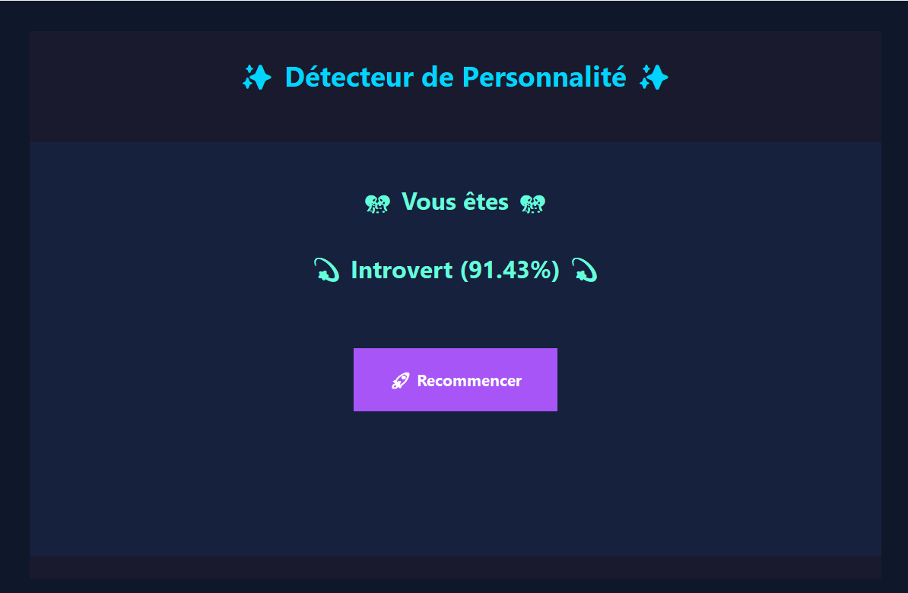

# 🧠 Personality Detector - Tkinter + TensorFlow



## 📝 Description

This project is an interactive **Personality Detection App** built with **Python**, leveraging **Tkinter** for the graphical user interface (GUI), **TensorFlow** for machine learning, and **Pandas/Numpy** for data processing.

The goal is to predict a user's personality type—**Introvert** or **Extrovert**—based on their social behaviors and habits.

---


## Accuracy

* > Training Accuracy: 94.08%
* > Testing Accuracy: 92.50%

## 🚀 Features

- 🧠 **Deep Learning Model** (TensorFlow) trained on labeled social behavior data
- 📊 **Data Normalization and Preprocessing**
- 💻 **GUI built with Tkinter**, styled with modern themes and emojis
- 🔍 **7-question quiz** to evaluate social tendencies
- 📈 Real-time prediction display with personality percentage
- 🧪 Includes a CLI test mode and model training function

---


## 📂 Dataset

The app uses a CSV dataset (`personality_dataset.csv`) containing features such as:

- Time spent alone per day
- Stage fear (Yes/No)
- Social event attendance frequency
- Number of outings per week
- Social exhaustion (Yes/No)
- Number of close friends
- Frequency of social media posts

---

## 🧰 Technologies Used

- **Python 3**
- **TensorFlow/Keras** – Neural network model
- **Pandas / Numpy** – Data processing
- **Scikit-learn** – Data splitting
- **Tkinter** – GUI framework

---

## 🧪 How It Works

1. **Training the Model**:

   - Load and normalize the dataset.
   - Train a neural network to distinguish between Introverts and Extroverts.
   - Save the model as `personality_detector_model.h5`.

2. **Making Predictions**:

   - The user answers 7 questions.
   - The trained model predicts personality based on responses.

3. **Graphical Interface**:

   - Simple and fun GUI with emojis and color feedback.
   - Results displayed instantly at the end of the quiz.

---

## 🛠️ Installation

```bash
# Clone the repo
git clone https://github.com/NathanRael/Personality_detector
cd Personality_detector

# (Optional) Create and activate a virtual environment
python -m venv venv
source venv/bin/activate  # On Windows: venv\Scripts\activate

# Install dependencies
pip install -r requirements.txt
```

---

## ▶️ Usage

### GUI Mode (Default)

```bash
python main.py
```

### Train the Model

Uncomment and run:

```python
# train_model()
```

### Test with Sample Data

Uncomment and run:

```python
# test_data()
```

---

## 🔗 Links

- 🧠 **Google Colab Demo**: [View Notebook](https://colab.research.google.com/drive/1vG5VU261K6UBBDIU11dOXu63M9L1bbkQ?usp=sharing)
- 💻 **GitHub Repo**: [https://github.com/NathanRael/Personality_detector](https://github.com/NathanRael/Personality_detector)

---

## 🙋 Contact

📨 **Natanael RALAIVOAVY**
📧 **[ralaivoavy.natanael@gmail.com](mailto:ralaivoavy.natanael@gmail.com)**
